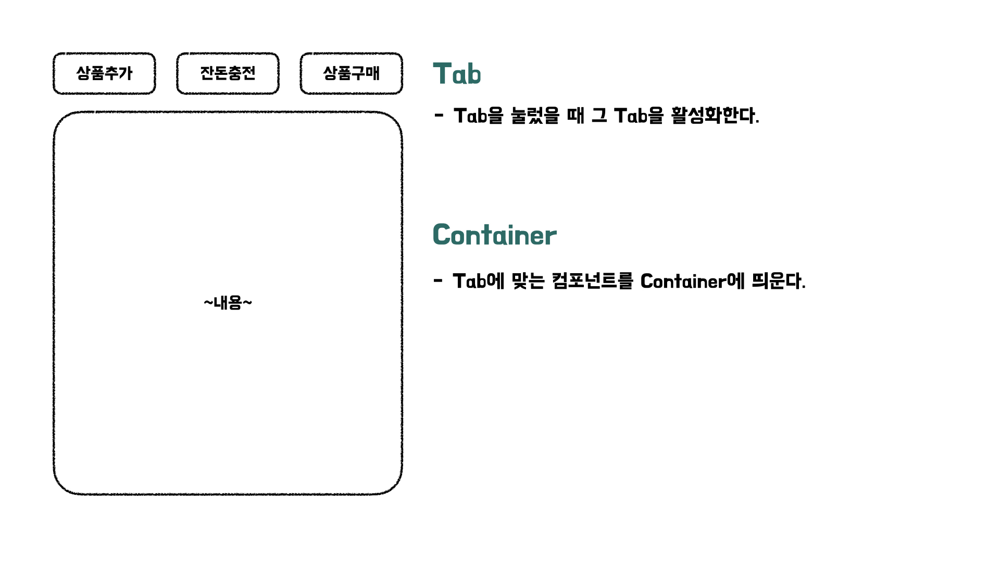
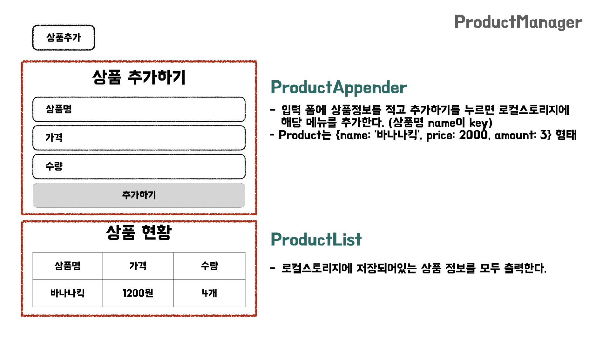

<h1 align="middle">자바스크립트와 Cypress로 구현하는 자판기</h1>

  
  
  
  
  

## 📝 설계 및 구현내용

### **🎯 1단계 - 상품 관리**

- [x] 탭 별로 그에 맞는 UI를 출력한다.
- [x] 상품정보 (이름, 가격, 수량)을 입력할 수 있다.
  - [ ] 모든 입력은 공백이어서는 안된다.
  - [ ] 수량은 1개 이상이어야 한다.
  - [ ] 가격은 100원 이상이어야 한다.
  - [ ] 가격은 10원으로 나누어 떨어저야 한다.
- [x] 추가하기를 누르면 상품정보가 로컬스토리지 Products에 추가된다.
- [x] 추가하기를 눌렀을 때 이미 동일한 이름의 상품정보가 있으면 새로 입력된 정보로 수정한다.
- [x] 상품 현황에 로컬스토리지에 저장된 Products를 표 형태로 출력한다. (아무것도 없으면 빈 표)

## 📝 요구사항

### **공통**

- 기존 [HTML Template](TEMPLATE.md)을 활용한다.
- 필요하다면 [선택자](SELECTOR.md)를 참고한다.
- 상단에 `탭`메뉴가 존재하며 각 탭에 따라 적절한 기능을 수행한다.
  - `상품 관리`탭은 자판기가 보유하고 있는 **물품을 추가**하는 기능을 수행한다.
  - `잔돈 충전`탭은 **자판기가 보유할 금액을 충전**하는 기능을 수행한다.
  - `상품 구매`탭은 사용자가 **금액을 충전**할 수 있으며, 금액에 맞춰 **상품을 구매**하고, 남은 금액에 대해서는 **잔돈을 반환**하는 기능을 수행한다.
- 다른 탭으로 이동했다 돌아와도 기존 탭의 상태가 유지되어야 한다.
- localStorage를 이용하여, 새로고침하더라도 가장 최근에 작업한 정보들을 불러올 수 있도록 한다.

### **🎯 1단계 - 상품 관리**

- `상품 관리`탭에서, 다음과 같은 규칙을 바탕으로 상품을 추가한다.
- 최초 상품 목록은 비워진 상태이다. (이미지 첨부)
- 상품명, 금액, 수량을 추가할 수 있다.
- 상품 추가 입력 폼에 상품명, 금액, 수량을 차례로 입력한다.
  - 상품명, 금액, 수량은 공백이 불가능하다.
  - 상품의 최소 수량은 1개여야 한다.
  - 상품의 최소 가격은 100원이며, 10원으로 나누어 떨어져야 한다.
    - 예) 콜라 / 110원 / 5개
    - 예) 사이다 / 100원 / 100개
- 같은 상품명의 데이터를 추가하면 기존의 상품에 해당하는 데이터는 새로운 상품으로 대체된다.
  - 콜라 / 1000원 / 12개(전) -> 콜라 / 1500원 / 10개(후) => 콜라 / 1500원 / 10개(결과)
- 사용자는 추가한 상품을 확인할 수 있다.
  - 상품의 이름, 가격, 수량 순으로 상품 목록이 보여진다. (이미지 첨부)
- 상품 목록은 탭을 이동하여도 기존의 상품 목록이 유지되어야 한다.

  
상품추가 그림

 

### **🎯 2단계 - 잔돈 충전**

- `잔돈 충전` 탭에서, 다음과 같은 규칙으로 자판기 보유 금액을 충전한다.
- `잔돈 충전` 페이지에서 최초 자판기가 보유한 금액은 0원이며, 각 동전의 개수는 0개이다.
- 관리자는 잔돈 충전 입력 요소에 충전할 금액을 입력한 후, `자판기 동전 충전` 버튼을 눌러 자판기가 보유한 금액을 충전할 수 있다.
  - 최소 충전 금액은 100원이며, 10원으로 나누어 떨어지는 금액만 충전이 가능하다.
  - 자판기가 보유한 금액은 `{금액}원` 형식으로 나타낸다. (이미지)
    - 예) 1000원 (o) / 1000 원 (x) / 1000 (x)
- 관리자는 잔돈을 누적하여 충전할 수 있다.
  - 1000원 충전 -> 500원 충전 => 총 1500원 분량의 동전이 생성됨. (추가)
- 자판기가 보유한 금액 만큼의 동전이 무작위로 생성된다.
  - 동전은 500원, 100원, 50원, 10원의 동전만 생성된다.
- 동전의 개수를 나타내는 정보는 `{개수}개` 형식으로 나타낸다.
  - 예) 1개 (o) / 1 개 (x) / 1 (x)
- 다른 탭을 클릭하여도 자판기가 보유한 금액은 유지되어야 한다.

  
잔돈충전 그림

 

### **🎯 3단계 - 상품 구매**

- `상품 구매`탭에서, 다음과 같은 규칙을 바탕으로 금액을 충전하고, 상품을 구매하며, 잔돈을 반환한다.
- `상품 구매` 페이지 에서 최초 충전 금액은 0원이며, 반환된 각 동전의 개수는 0개이다.
- 사용자는 금액 충전 입력 요소에 충전할 금액을 입력한 후, `구매 금액 충전`버튼을 이용하여 금액을 충전한다.
  - 최소 충전 금액은 10원이다.
  - 금액은 10원으로 나누어 떨어지는 금액만 충전이 가능하다.
  - 자판기가 보유한 금액은 `{금액}원` 형식으로 나타낸다. (이미지)
    - 예) 1000원 (o) / 1000 원 (x) / 1000 (x)
- 금액은 누적으로 충전이 가능하다.
  - 1000원 충전 -> 500원 충전 => 1500원
- 사용자는 충전한 금액을 바탕으로 상품을 구매할 수 있다.
  - 상품 구매에 성공하면, 충전한 금액이 상품 금액만큼 차감 된다. 또한 상품의 수량도 차감된다.
  - 수량이 0인 상품은 구매할 수 없다.
  - 구매하려는 상품 가격이 보유하고 있는 금액보다 높은 경우 상품을 구매할 수 없다.
- 사용자는 `반환하기` 버튼을 통해 잔돈을 반환 받을 수 있다.
  - 잔돈 반환 규칙은 `잔돈 계산 모듈` 요구사항의 규칙을 따른다.

  
상품구매 그림

 

### **🎯 4단계 - 잔돈 계산 모듈**

- `상품 구매` 탭에서, 잔돈 반환 시 다음과 같은 규칙을 통해 잔돈을 반환한다.
- 최소 개수의 동전으로 잔돈을 돌려준다.
  - 예) 자판기가 보유한 동전 100원 5개, 500원 1개인 상태이고, 500원을 거슬러줘야 한다면 500원 1개를 반환한다.
  - 예) 자판기가 보유한 동전 100원 5개, 500원 2개인 상태이고, 1000원을 거슬러줘야 한다면 500원 2개를 반환한다.
  - 예) 자판기가 보유한 동전 100원 6개, 500원 1개인 상태이고, 1000원을 거슬러줘야 한다면 100원 5개 500원 1개를 반환한다.
- 지폐를 잔돈으로 반환하는 경우는 없다고 가정한다.
- 모든 금액에 대해 잔돈을 반환할 수 없는 경우 잔돈으로 반환할 수 있는 금액만 반환한다.
  - 예) 자판기가 보유한 동전 500원 2개인 상태이고, 800원을 거슬러줘야 한다면 500원 1개만 반환한다. 나머지 300원에 해당하는 금액은 반환하지 않는다. (이미지 첨부)
- 동전의 개수를 나타내는 정보는 `{개수}개` 형식으로 나타낸다.
  - 예) 1개 (o) / 1 개 (x) / 1 (x)
- 반환한 동전만큼 사용자가 충전한 금액이 차감된다.
- 반환한 동전만큼 자판기가 보유하고 있는 동전도 차감된다.
- 반환한 동전의 결과는 누적되지 않는다.
